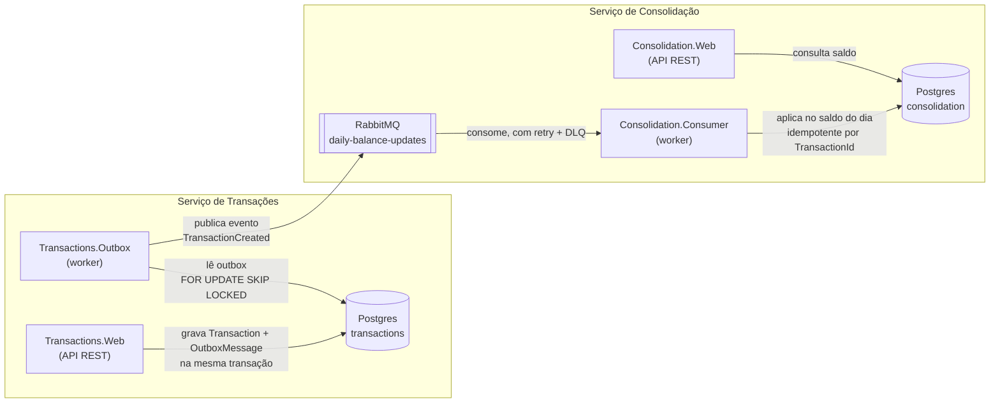

# CashFlow

Solução para o desafio de Arquiteto de Software: um comerciante precisa controlar o fluxo de caixa
diário (lançamentos de débito/crédito) e consultar o saldo diário consolidado.

O desafio original está em [docs/desafio-arquiteto-software-jan25.pdf](docs/desafio-arquiteto-software-jan25.pdf).
Diagramas mais completos (camadas, fluxo temporal, deployment) estão em
[docs/architecture.md](docs/architecture.md). As decisões de arquitetura estão documentadas em
[docs/adr](docs/adr).

## Visão geral da arquitetura

Dois serviços independentes, cada um com seu próprio banco, comunicando-se de forma assíncrona via
RabbitMQ. Essa é a decisão central do desenho: **o serviço de Transações nunca depende do serviço de
Consolidação estar no ar** — ele nunca fala com o RabbitMQ de forma síncrona, apenas grava numa tabela
de outbox dentro da própria transação de banco que já criaria o lançamento.



**Por que assim:**

- **Outbox** (Transações) — garante que o lançamento é persistido e o evento é publicado de forma
  atômica; se o RabbitMQ estiver fora do ar, o lançamento é salvo normalmente e o worker publica
  depois, com retry.
- **Retry + Dead-Letter Queue** (Consolidação) — uma mensagem que falha repetidamente não fica
  reentregue para sempre travando a fila; após esgotar as tentativas, ela é movida para uma fila de
  descarte (`daily-balance-updates.failed`) para inspeção manual.
- **Inbox / idempotência** (Consolidação) — como o Consolidado não tem acesso ao banco de Transações,
  ele mantém seu próprio registro de quais `TransactionId` já aplicou, protegendo contra reentrega
  duplicada de mensagens — inclusive se o consumer rodar em múltiplas instâncias simultâneas.

Detalhes e trade-offs de cada uma dessas decisões estão em [docs/adr/0001-idempotencia-e-limite-atual-de-escalabilidade-do-consumer.md](docs/adr/0001-idempotencia-e-limite-atual-de-escalabilidade-do-consumer.md).

### Camadas

Cada serviço segue a mesma organização em camadas (Clean Architecture / DDD-lite), mais um projeto
`Shared` com o kernel comum (`BaseEntity`, abstrações de repositório/unit of work, CQRS pipeline):

```text
Domain          → entidades e regras de negócio, sem dependências externas
Application     → casos de uso (CQRS com MediatR), validação (FluentValidation), abstrações
Infrastructure  → EF Core/Postgres, RabbitMQ, implementação das abstrações
Web / Worker    → API REST (Minimal APIs) ou BackgroundService, ponto de entrada do processo
```

## Como rodar localmente

Duas formas de subir o projeto: tudo em containers com um único comando, ou os serviços .NET
rodando localmente (com só Postgres/RabbitMQ em container) — mais prático para debugar com breakpoints.

### Opção 1 — Stack completa em containers

```bash
make up-all
```

Os `Dockerfile` de cada serviço são propositalmente simples (`COPY ./publish .`, sem etapa de build
dentro da imagem) — por isso `make up-all` primeiro roda `dotnet publish` dos 4 projetos localmente
(requer o .NET 8 SDK) e só então builda as imagens e sobe tudo: Postgres, RabbitMQ, `Transactions.Web`,
`Transactions.Outbox`, `Consolidation.Web` e `Consolidation.Consumer`, já conectados entre si na rede
do Compose. As migrations são aplicadas automaticamente por cada API ao subir. Portas expostas: `5222`
(Transactions) e `5224` (Consolidation) — as mesmas usadas na Opção 2.

```bash
make down-all   # para tudo
make logs-all   # acompanha os logs de todos os serviços
```

### Opção 2 — Serviços .NET local, infra em container

#### Pré-requisitos

- [.NET 8 SDK](https://dotnet.microsoft.com/download/dotnet/8.0)
- Docker (para Postgres e RabbitMQ via `docker-compose`)
- `make` (opcional, mas todos os comandos abaixo têm um alvo no `Makefile`)

#### Passo a passo

```bash
# 1. Sobe Postgres e RabbitMQ
make up

# 2. Restaura dependências e builda a solução
make restore
make build

# 3. Aplica as migrations em cada banco
make migrate-transactions
make migrate-consolidation
```

> Em ambiente de Desenvolvimento, cada API também aplica suas próprias migrations automaticamente ao
> subir (`ApplyMigrationsAsync`), então o passo 3 é uma garantia, não estritamente obrigatório.

Depois, em 4 terminais separados (são 4 processos independentes):

```bash
make run-transactions-web        # API de lançamentos      → http://localhost:5222/swagger
make run-transactions-worker     # publica o outbox no RabbitMQ
make run-consolidation-web       # API de saldo diário     → http://localhost:5224/swagger
make run-consolidation-consumer  # consome eventos e consolida o saldo
```

RabbitMQ Management UI: [http://localhost:15672](http://localhost:15672) (usuário/senha: `guest`/`guest`).

Veja `make help` para a lista completa de comandos (build, migrations, format, etc).

### Serviços e portas

| Serviço | Tipo | Porta / URL | Banco |
| --- | --- | --- | --- |
| CashFlow.Transactions.Web | API REST | `http://localhost:5222` | `transactions` |
| CashFlow.Transactions.Outbox | Worker | — | `transactions` |
| CashFlow.Consolidation.Web | API REST | `http://localhost:5224` | `consolidation` |
| CashFlow.Consolidation.Consumer | Worker | — | `consolidation` |
| PostgreSQL | Banco de dados | `localhost:5432` | `transactions`, `consolidation` |
| RabbitMQ | Broker | AMQP `localhost:5672`, UI `localhost:15672` | — |

## API

### Criar lançamento

```bash
curl -X POST http://localhost:5222/api/transactions \
  -H "Content-Type: application/json" \
  -d '{
    "amount": 150.00,
    "type": "Credit",
    "description": "Venda de produto"
  }'
```

`type` aceita `"Credit"` ou `"Debit"`. `amount` deve ser maior que zero (até 2 casas decimais).
`description` é opcional, até 200 caracteres.

Resposta `200 OK`:

```json
{
  "id": "b3f1...",
  "amount": 150.00,
  "type": "Credit",
  "description": "Venda de produto",
  "createdAtUtc": "2026-07-27T14:32:00Z"
}
```

### Listar lançamentos (paginado, com filtro de data)

```bash
curl "http://localhost:5222/api/transactions?PageNumber=1&PageSize=10&StartDate=2026-07-01&EndDate=2026-07-31"
```

Resposta `200 OK`:

```json
{
  "items": [ { "id": "...", "amount": 150.00, "type": "Credit", "description": "...", "createdAtUtc": "..." } ],
  "pageNumber": 1,
  "pageSize": 10,
  "totalItems": 1,
  "totalPages": 1,
  "hasPreviousPage": false,
  "hasNextPage": false
}
```

### Consultar saldo diário consolidado

```bash
curl http://localhost:5224/api/daily-balances/2026-07-27
```

Resposta `200 OK`:

```json
{ "id": "...", "date": "2026-07-27", "totalCredits": 150.00, "totalDebits": 0, "balance": 150.00 }
```

Se não houver saldo para a data, retorna `404 Not Found`.

> Entre criar um lançamento e o saldo refletir a mudança existe uma janela de consistência eventual
> (outbox → RabbitMQ → consumer), tipicamente de milissegundos em condições normais — isso é
> intencional, é o preço da Transações não depender do Consolidado.

Ambas as APIs expõem Swagger (`/swagger`) e um health check em `/health`.

## Requisitos não funcionais — como foram endereçados

- **"Transações não deve ficar indisponível se o Consolidado cair"**: a API de Transações nunca
  toca no RabbitMQ diretamente; ela só grava no banco. Se o Consolidado ou o RabbitMQ estiverem fora
  do ar, lançamentos continuam sendo criados normalmente e ficam na fila do Outbox até serem
  publicados.
- **"50 req/s no Consolidado, até 5% de perda"**: o consumer processa mensagens com confirmação
  manual (`ack`/`nack`) e um mecanismo de retry com atraso (fila de retry com TTL) + fila de
  dead-letter para mensagens que esgotam as tentativas — uma falha isolada não trava o restante da
  fila nem gera reentrega infinita.

## Testes

```bash
make test
# ou: dotnet test CashFlow.sln
```

- **Unitários** (`*.Domain.Tests`, `*.Application.Tests` em cada serviço): regras de domínio
  (`Transaction`, `DailyBalance`), handlers de Application com repositórios/unit of work mockados
  (NSubstitute) e validadores (FluentValidation.TestHelper). Não precisam de Docker.
- **Integração** (`tests/CashFlow.IntegrationTests`): sobe Postgres e RabbitMQ reais via
  [Testcontainers](https://dotnet.testcontainers.org/) e exercita as classes de produção de ponta a
  ponta — cria um lançamento, roda o publisher do outbox, consome da fila real com o
  `RabbitMqMessageBrokerConsumer` de verdade e confere o saldo consolidado no banco; um segundo teste
  publica uma mensagem que falha sempre e confirma que ela é movida para a fila de dead-letter. **Exige
  Docker rodando localmente** (`make up` não é necessário — o teste sobe seus próprios containers
  efêmeros).

Escrever o teste de integração revelou dois bugs reais que passaram despercebidos até então: a fila
`daily-balance-updates` era declarada com argumentos diferentes pelo publisher do outbox e pelo
consumer (o RabbitMQ rejeita isso com `PRECONDITION_FAILED` dependendo de quem sobe primeiro), e a
conexão do RabbitMQ do lado do Consolidado não habilitava `DispatchConsumersAsync`, então o
`AsyncEventingBasicConsumer` nunca recebia entregas — nenhum dos dois erros aparecia em teste unitário
com mocks. Ambos foram corrigidos.

## Evoluções futuras / o que eu faria com mais tempo

- **Health checks mais completos**: hoje só verificam o banco; não há verificação de conectividade
  com o RabbitMQ nem nos workers.
- **Autenticação/autorização** nas APIs — fora do escopo funcional descrito no desafio, mas seria o
  próximo passo antes de um ambiente real.
- **Reprocessamento de mensagens da outbox com erro**: hoje uma mensagem que falhou na publicação
  fica marcada e não é mais tentada automaticamente; faltaria um mecanismo de retry/alerta para essas
  linhas.
