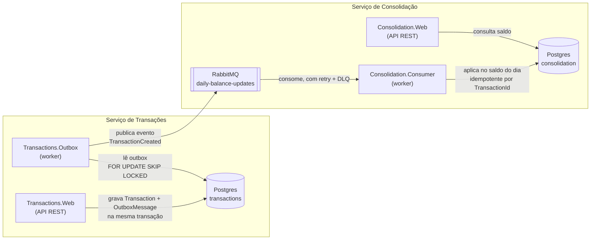

# CashFlow

[](https://github.com/lhpvolpi/cash-flow/actions/workflows/ci.yml)

Solução para o desafio de Arquiteto de Software: um comerciante precisa controlar o fluxo de caixa
diário (lançamentos de débito/crédito) e consultar o saldo diário consolidado.

O desafio original está em [docs/desafio-arquiteto-software-jan25.pdf](docs/desafio-arquiteto-software-jan25.pdf).
Diagramas mais completos (camadas, fluxo temporal, deployment) estão em
[docs/architecture.md](docs/architecture.md). As decisões de arquitetura estão documentadas em
[docs/adr](docs/adr).

## Visão geral da arquitetura

Dois serviços independentes, cada um com seu próprio banco, comunicando-se de forma assíncrona via
RabbitMQ. Essa é a decisão central do desenho: **o serviço de Transações nunca depende do serviço de
Consolidação estar no ar** — ele nunca fala com o RabbitMQ de forma síncrona, apenas grava numa tabela
de outbox dentro da própria transação de banco que já criaria o lançamento.



**Por que assim:**

- **Outbox** (Transações) — garante que o lançamento é persistido e o evento é publicado de forma
  atômica; se o RabbitMQ estiver fora do ar, o lançamento é salvo normalmente e o worker publica
  depois, com retry.
- **Retry + Dead-Letter Queue** (Consolidação) — uma mensagem que falha repetidamente não fica
  reentregue para sempre travando a fila; após esgotar as tentativas, ela é movida para uma fila de
  descarte (`daily-balance-updates.failed`) para inspeção manual.
- **Inbox / idempotência** (Consolidação) — como o Consolidado não tem acesso ao banco de Transações,
  ele mantém seu próprio registro de quais `TransactionId` já aplicou, protegendo contra reentrega
  duplicada de mensagens — inclusive se o consumer rodar em múltiplas instâncias simultâneas.

Detalhes e trade-offs de cada uma dessas decisões estão em [docs/adr/0001-idempotencia-e-limite-atual-de-escalabilidade-do-consumer.md](docs/adr/0001-idempotencia-e-limite-atual-de-escalabilidade-do-consumer.md).

### Camadas

Cada serviço segue a mesma organização em camadas (Clean Architecture / DDD-lite), mais um projeto
`Shared` com o kernel comum (`BaseEntity`, abstrações de repositório/unit of work, CQRS pipeline):

```text
Domain          → entidades e regras de negócio, sem dependências externas
Application     → casos de uso (CQRS com MediatR), validação (FluentValidation), abstrações
Infrastructure  → EF Core/Postgres, RabbitMQ, implementação das abstrações
Web / Worker    → API REST (Minimal APIs) ou BackgroundService, ponto de entrada do processo
```

## Como rodar localmente

Duas formas de subir o projeto: tudo em containers com um único comando, ou os serviços .NET
rodando localmente (com só Postgres/RabbitMQ em container) — mais prático para debugar com breakpoints.

### Opção 1 — Stack completa em containers

```bash
make up-all
```

Os `Dockerfile` de cada serviço são propositalmente simples (`COPY ./publish .`, sem etapa de build
dentro da imagem) — por isso `make up-all` primeiro roda `dotnet publish` dos 5 projetos localmente
(requer o .NET 8 SDK) e só então builda as imagens e sobe tudo: Postgres, RabbitMQ, `Transactions.Web`,
`Transactions.Outbox`, `Consolidation.Web`, `Consolidation.Consumer` e `Auth.Web`, já conectados entre
si na rede do Compose. As migrations são aplicadas automaticamente por cada API ao subir. Portas
expostas: `5222` (Transactions), `5224` (Consolidation) e `5226` (Auth) — as mesmas usadas na Opção 2.

```bash
make down-all   # para tudo
make logs-all   # acompanha os logs de todos os serviços
```

### Opção 2 — Serviços .NET local, infra em container

#### Pré-requisitos

- [.NET 8 SDK](https://dotnet.microsoft.com/download/dotnet/8.0)
- Docker (para Postgres e RabbitMQ via `docker-compose`)
- `make` (opcional, mas todos os comandos abaixo têm um alvo no `Makefile`)
- `jq` (opcional, só pros exemplos de `curl` abaixo que extraem o token do JSON de resposta)

#### Passo a passo

```bash
# 1. Sobe Postgres e RabbitMQ
make up

# 2. Restaura dependências e builda a solução
make restore
make build

# 3. Aplica as migrations em cada banco
make migrate-transactions
make migrate-consolidation
```

> Em ambiente de Desenvolvimento, cada API também aplica suas próprias migrations automaticamente ao
> subir (`ApplyMigrationsAsync`), então o passo 3 é uma garantia, não estritamente obrigatório.

Depois, em 5 terminais separados (são 5 processos independentes):

```bash
make run-transactions-web        # API de lançamentos      → http://localhost:5222/swagger
make run-transactions-worker     # publica o outbox no RabbitMQ
make run-consolidation-web       # API de saldo diário     → http://localhost:5224/swagger
make run-consolidation-consumer  # consome eventos e consolida o saldo
make run-auth-web                # API de autenticação     → http://localhost:5226/swagger
```

RabbitMQ Management UI: [http://localhost:15672](http://localhost:15672) (usuário/senha: `guest`/`guest`).

Veja `make help` para a lista completa de comandos (build, migrations, format, etc).

### Serviços e portas

| Serviço | Tipo | Porta / URL | Banco |
| --- | --- | --- | --- |
| CashFlow.Transactions.Web | API REST | `http://localhost:5222` | `transactions` |
| CashFlow.Transactions.Outbox | Worker | `http://localhost:5223` (só health) | `transactions` |
| CashFlow.Consolidation.Web | API REST | `http://localhost:5224` | `consolidation` |
| CashFlow.Consolidation.Consumer | Worker | `http://localhost:5225` (só health) | `consolidation` |
| CashFlow.Auth.Web | API REST | `http://localhost:5226` | — |
| PostgreSQL | Banco de dados | `localhost:5432` | `transactions`, `consolidation` |
| RabbitMQ | Broker | AMQP `localhost:5672`, UI `localhost:15672` | — |

## API

Transactions e Consolidation exigem um JWT válido (ver [Serviço de Auth](#serviço-de-auth)
abaixo). Obtenha um token antes de chamar qualquer endpoint:

```bash
TOKEN=$(curl -s -X POST http://localhost:5226/api/auth/login \
  -H "Content-Type: application/json" \
  -d '{"username": "admin", "password": "admin123"}' | jq -r '.token')
```

### Criar lançamento

```bash
curl -X POST http://localhost:5222/api/transactions \
  -H "Content-Type: application/json" \
  -H "Authorization: Bearer $TOKEN" \
  -d '{
    "amount": 150.00,
    "type": "Credit",
    "description": "Venda de produto"
  }'
```

`type` aceita `"Credit"` ou `"Debit"`. `amount` deve ser maior que zero (até 2 casas decimais).
`description` é opcional, até 200 caracteres.

Resposta `200 OK`:

```json
{
  "id": "b3f1...",
  "amount": 150.00,
  "type": "Credit",
  "description": "Venda de produto",
  "createdAtUtc": "2026-07-27T14:32:00Z"
}
```

### Listar lançamentos (paginado, com filtro de data)

```bash
curl "http://localhost:5222/api/transactions?PageNumber=1&PageSize=10&StartDate=2026-07-01&EndDate=2026-07-31" \
  -H "Authorization: Bearer $TOKEN"
```

Resposta `200 OK`:

```json
{
  "items": [ { "id": "...", "amount": 150.00, "type": "Credit", "description": "...", "createdAtUtc": "..." } ],
  "pageNumber": 1,
  "pageSize": 10,
  "totalItems": 1,
  "totalPages": 1,
  "hasPreviousPage": false,
  "hasNextPage": false
}
```

### Consultar saldo diário consolidado

```bash
curl http://localhost:5224/api/daily-balances/2026-07-27 \
  -H "Authorization: Bearer $TOKEN"
```

Resposta `200 OK`:

```json
{ "id": "...", "date": "2026-07-27", "totalCredits": 150.00, "totalDebits": 0, "balance": 150.00 }
```

Se não houver saldo para a data, retorna `404 Not Found`.

> Entre criar um lançamento e o saldo refletir a mudança existe uma janela de consistência eventual
> (outbox → RabbitMQ → consumer), tipicamente de milissegundos em condições normais — isso é
> intencional, é o preço da Transações não depender do Consolidado.

Ambas as APIs expõem Swagger (`/swagger`). Os 4 processos originais do desafio (as 2 APIs e os 2
workers) expõem dois endpoints de health check, no padrão liveness/readiness (o Auth também expõe
`/health/live`, mas sem dependência externa pra checar — ver [Serviço de Auth](#serviço-de-auth)):

- `/health/live` — sempre `Healthy` se o processo está de pé (não executa nenhuma dependência).
- `/health/ready` — só fica `Healthy` se Postgres **e** RabbitMQ estiverem alcançáveis
  ([AspNetCore.HealthChecks](https://github.com/Xabaril/AspNetCore.Diagnostics.HealthChecks) —
  a Microsoft não tem pacote oficial para broker de mensagens, só para EF Core/Postgres).

Nos workers (que não expõem nenhuma outra rota HTTP, sem Swagger/endpoints de negócio), isso é feito
com `Host.CreateDefaultBuilder` + `.ConfigureWebHostDefaults(...)` só para mapear as duas rotas de
health — sem migrar para `WebApplication`/Minimal APIs, mudança mínima em cima do worker já existente.
Pensado para Kubernetes: `/health/live` vira `livenessProbe` (reinicia o pod), `/health/ready` vira
`readinessProbe` (tira da rotação de tráfego/consumo enquanto a dependência estiver fora).

## Requisitos não funcionais — como foram endereçados

- **"Transações não deve ficar indisponível se o Consolidado cair"**: a API de Transações nunca
  toca no RabbitMQ diretamente; ela só grava no banco. Se o Consolidado ou o RabbitMQ estiverem fora
  do ar, lançamentos continuam sendo criados normalmente e ficam na fila do Outbox até serem
  publicados.
- **"50 req/s no Consolidado, até 5% de perda"**: o consumer processa mensagens com confirmação
  manual (`ack`/`nack`) e um mecanismo de retry com atraso (fila de retry com TTL) + fila de
  dead-letter para mensagens que esgotam as tentativas — uma falha isolada não trava o restante da
  fila nem gera reentrega infinita. Validado empiricamente com um teste de carga (ver
  [Teste de carga](#teste-de-carga) abaixo).

### Teste de carga

O Outbox já garante que um lançamento chega na fila (com retry próprio); o requisito de 50 req/s
com até 5% de perda é, na prática, uma pergunta sobre o **consumer**: ele dá conta de processar e
consolidar nessa taxa sem que mensagens se percam? Testar o `GET /api/daily-balances/{date}` não
provaria isso — é uma leitura simples que passaria de qualquer forma.

[`tools/CashFlow.LoadTest`](tools/CashFlow.LoadTest) publica mensagens sintéticas **diretamente**
na fila `daily-balance-updates` (contornando Transactions/Outbox de propósito, para isolar o
consumer), reaproveitando os mesmos tipos de produção (`BrokerMessage`, `OperationEventPayload`,
serialização) usados pelo publisher real. Cada mensagem tem um `TransactionId` (Guid) único. Depois
de publicar na taxa alvo, o teste espera uma janela de graça (tempo suficiente para o
retry+dead-letter agirem) e consulta `processed_transactions` no Postgres para contar quantos
`TransactionId`s publicados foram efetivamente consolidados.

```bash
# com o Consolidation.Consumer rodando (make up-all, ou local via make run-consolidation-consumer)
make load-test                          # padrão: 50 msg/s por 60s
make load-test RATE=100 DURATION=30     # ou taxa/duração customizadas
# equivalente direto: dotnet run --project tools/CashFlow.LoadTest -- 50 60
```

Última execução (50 msg/s por 60s, 3000 mensagens):

```text
Mensagens enviadas:      3000
Mensagens consolidadas:  3000
Mensagens perdidas:      0
Taxa de perda:           0,00%
RESULTADO: dentro do limite de 5% de perda exigido pelo NFR.
```

## Testes

```bash
make test
# ou: dotnet test CashFlow.sln
```

Roda automaticamente a cada `push`/PR na `main` via
[GitHub Actions](.github/workflows/ci.yml) (build + os 59 testes, incluindo os de integração —
o runner do GitHub já vem com Docker, então o Testcontainers funciona sem configuração extra).

- **Unitários** (`*.Domain.Tests`, `*.Application.Tests` em cada serviço, incluindo Auth): regras
  de domínio (`Transaction`, `DailyBalance`), handlers de Application com repositórios/serviços
  mockados (NSubstitute) e validadores (FluentValidation.TestHelper). Não precisam de Docker.
- **Integração — Transactions/Consolidation** (`tests/CashFlow.IntegrationTests`): sobe Postgres e
  RabbitMQ reais via [Testcontainers](https://dotnet.testcontainers.org/) e exercita as classes de
  produção de ponta a ponta — cria um lançamento, roda o publisher do outbox, consome da fila real
  com o `RabbitMqMessageBrokerConsumer` de verdade e confere o saldo consolidado no banco; um
  segundo teste publica uma mensagem que falha sempre e confirma que ela é movida para a fila de
  dead-letter; um terceiro par de testes resolve o `HealthCheckService` de cada serviço e confirma
  que os checks de Postgres e RabbitMQ reportam `Healthy` contra dependências reais; um quarto par
  (`TransactionsAuthorizationTests`/`ConsolidationAuthorizationTests`) sobe o `Transactions.Web`/
  `Consolidation.Web` reais via `WebApplicationFactory` e confirma `401` sem token, `401` com token
  inválido e sucesso com um JWT válido — pipeline HTTP real, incluindo o middleware de autenticação.
  **Exige Docker rodando localmente** (`make up` não é necessário — o teste sobe seus próprios
  containers efêmeros, isolados do ambiente de dev).
- **Integração — Auth** (`services/auth/tests/CashFlow.Auth.IntegrationTests`): sem Postgres/
  RabbitMQ (o serviço não depende de nenhum dos dois), então monta o `ServiceProvider` real
  (`AddApplicationServices` + `AddInfrastructureServices`) com configuração em memória e manda o
  `LoginCommand` de verdade pelo `IMediator` — confere que o JWT emitido decodifica com
  issuer/audience/subject corretos, que senha errada lança `InvalidCredentialsException`, e que
  campos vazios lançam `ValidationException` pelo pipeline. Não exige Docker.

## Serviço de Auth

Serviço de autenticação (`services/auth`) responsável por emitir um JWT a partir de usuário/senha,
usado para proteger as APIs de Transactions e Consolidation. Faz parte do `CashFlow.sln` principal
(`dotnet build`/`dotnet test`/CI cobrem os 4 projetos + os 2 de teste normalmente), do
`docker-compose.yaml` (serviço `auth-web`, perfil `app`) e do Makefile (`make run-auth-web`,
incluído em `make up-all`/`make publish-all`).

Mesma Clean Architecture dos outros serviços (Domain → Application → Infrastructure → Web):

- **Domain**: `AuthToken` (Token, RefreshToken, ExpiresAtUtc).
- **Application**: `LoginCommand`/`LoginCommandHandler`/`LoginCommandValidator`
  (`AuthTokens/Login/Commands`), `IAuthTokenService`, `InvalidCredentialsException`.
- **Infrastructure**: `AuthTokenService` — valida credenciais e gera o JWT (HMAC-SHA256).
- **Web**: `POST /api/auth/login`, Swagger em `/swagger`, `/health/live`.

```bash
make run-auth-web
# ou local: cd services/auth/src/CashFlow.Auth.Web && ASPNETCORE_ENVIRONMENT=Development dotnet run
# ou via Docker: make up-all (sobe junto com Transactions/Consolidation)
```

```bash
curl -X POST http://localhost:5226/api/auth/login \
  -H "Content-Type: application/json" \
  -d '{"username": "admin", "password": "admin123"}'
```

Usuário/senha de desenvolvimento (`Auth:Username`/`Auth:Password`) e o segredo do JWT
(`Jwt:Secret`) estão em `appsettings.Development.json` desse serviço. Diferente dos outros 4
serviços, não depende de Postgres/RabbitMQ — por isso não tem `depends_on` no compose.

**Possíveis evoluções:**

- **Fluxo completo de refresh token**: o login já emite um refresh token junto com o access token;
  o próximo passo natural é um endpoint que o troque por um novo access token (com a devida
  persistência para permitir revogação).
- **Repositório de usuários**: hoje a autenticação valida um único usuário de referência via
  configuração (`Auth:Username`/`Auth:Password`), suficiente para o escopo atual; evoluir para
  cadastro com múltiplos usuários e senha com hash em banco é o próximo passo natural para um
  cenário multiusuário.
- **Gestão de segredos**: o segredo do JWT em `appsettings.Development.json` segue o mesmo padrão
  das demais credenciais de desenvolvimento já usadas no projeto (Postgres/RabbitMQ); em produção,
  viria de variável de ambiente ou secrets manager.

`Transactions.Web` e `Consolidation.Web` já validam o JWT emitido por esse serviço
(`Microsoft.AspNetCore.Authentication.JwtBearer`, mesmo secret/issuer/audience) e exigem
`Authorization: Bearer <token>` em `/api/transactions` e `/api/daily-balances`
(`.RequireAuthorization()` nos grupos de endpoint) — `/health/live`/`/health/ready` continuam
públicos de propósito, pra não quebrar probes/load balancer. Sem token ou com token
inválido/expirado → `401`.

## Evoluções futuras / o que eu faria com mais tempo

- **Reprocessamento de mensagens da outbox com erro**: hoje uma mensagem que falhou na publicação
  fica marcada e não é mais tentada automaticamente; faltaria um mecanismo de retry/alerta para essas
  linhas.
