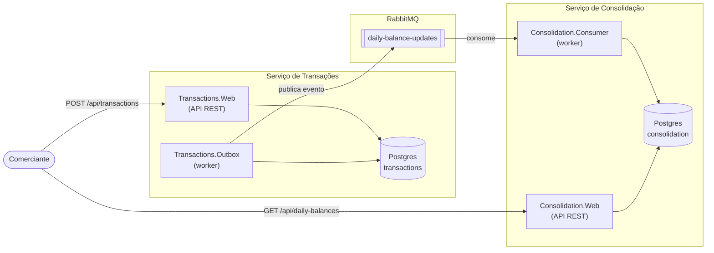
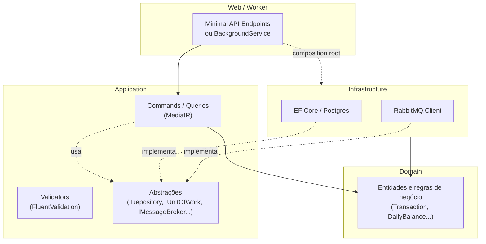
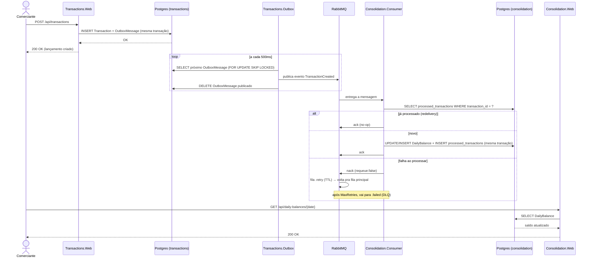
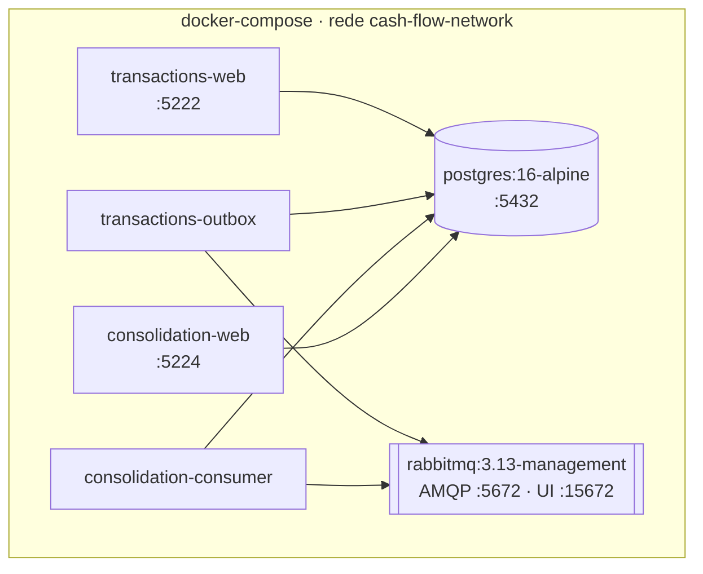

# Arquitetura

Este documento complementa o [README](../README.md) com uma visão mais detalhada do desenho da
solução: como os dois serviços se relacionam, como cada um é organizado internamente, o fluxo
temporal de um lançamento até aparecer no saldo consolidado, e como tudo isso é implantado em
containers.

## 1. Visão geral do sistema

Dois bancos de dados independentes, um por serviço — nenhum dos dois acessa o schema do outro
diretamente. A única via de comunicação entre eles é o evento assíncrono publicado na fila
`daily-balance-updates`. Essa é a decisão central do desenho: o serviço de Transações nunca fala
com o RabbitMQ de forma síncrona (só grava no próprio banco), então ele nunca fica indisponível por
causa do Consolidado ou do broker.

## 2. Arquitetura em camadas (Clean Architecture)

Ambos os serviços seguem a mesma organização interna — a diferença entre eles é só o conteúdo de
cada camada, não a forma:

- **Domain** não depende de nada — só as regras de negócio (ex.: `Transaction` valida seu próprio
  valor e tipo no construtor; `DailyBalance.Apply` soma crédito/débito).
- **Application** depende só de Domain, e define os *ports* (interfaces) que a Infrastructure
  implementa — a direção da dependência é invertida de propósito (Dependency Inversion), então
  Application nunca sabe que existe Postgres ou RabbitMQ.
- **Infrastructure** implementa os ports de Application usando EF Core e RabbitMQ.Client.
- **Web/Worker** é só o ponto de entrada do processo: mapeia endpoints ou inicia o
  `BackgroundService`, e no *composition root* (`Program.cs`/`DependencyInjection.cs`) registra qual
  implementação concreta de Infrastructure satisfaz cada port de Application.

## 3. Fluxo de um lançamento até o saldo consolidado

O diagrama abaixo mostra por que existe uma janela de consistência eventual entre criar um
lançamento e ele aparecer no saldo — e onde cada peça de resiliência (Outbox, retry, idempotência)
entra:

Pontos que esse diagrama explica:

- O lançamento é confirmado ao comerciante (`200 OK`) **antes** de qualquer contato com o
  RabbitMQ — é por isso que a queda do Consolidado ou do broker não afeta a criação de lançamentos.
- O saldo consolidado não muda instantaneamente; ele reflete a mudança assim que o outbox publica e
  o consumer processa (na prática, milissegundos em condições normais).
- Se a mesma mensagem for entregue duas vezes (redelivery do broker), a checagem de idempotência
  (padrão Inbox) garante que o saldo não seja contado em duplicidade.
- Se o processamento falhar de forma persistente, a mensagem não fica reentregue para sempre — ela
  circula pela fila de retry (com atraso) até esgotar as tentativas e ir para a fila de
  dead-letter, para inspeção manual.

## 4. Deployment (containers)

`postgres` e `rabbitmq` sobem sempre (`make up`); os quatro serviços .NET ficam no profile `app` do
Compose e só sobem com `make up-all` — isso preserva o fluxo de desenvolvimento local (rodar os
serviços via `dotnet run` contra a infra em container) sem conflito de porta com a stack
inteira em containers. Veja a seção **Como rodar localmente** do README para as duas opções.

## Decisões arquiteturais detalhadas

Trade-offs específicos (idempotência, retry/DLQ, escalabilidade horizontal do consumer) estão
documentados como ADRs em [docs/adr](adr/).
